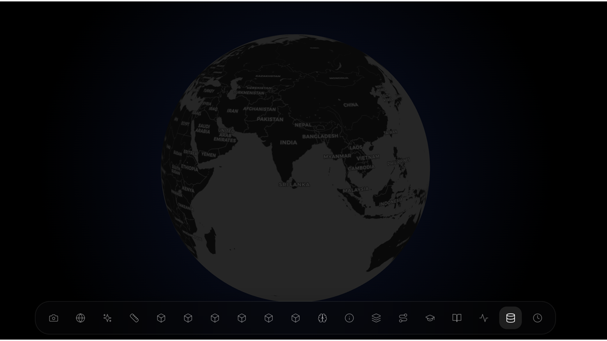
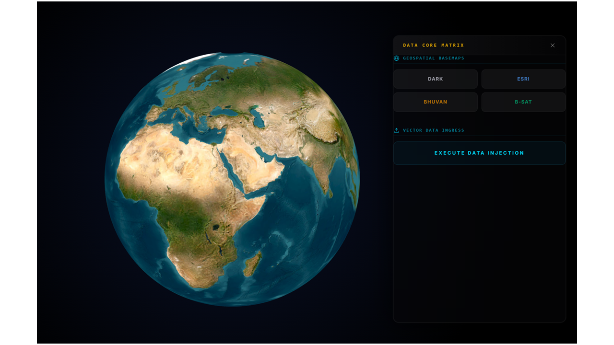
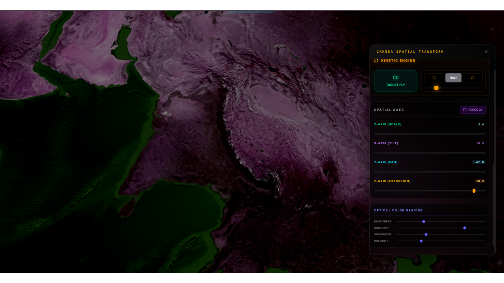

# Geospatial AI Learning Journey

## Note
This repository contains selected outputs from my learning experiments.  
The full codebase is kept private but can be shared on request.

---

## Background

I started learning AI and programming recently with no prior experience.  
Coming from a Geography background, I began exploring maps, spatial data, and simple system behavior through small experiments.

At the beginning, AI felt like a “black box” that simply produced outputs.  
Over time, through experimentation, I started to understand that results depend on how systems, data, and logic are structured.

---

## Sample Output

### 1. Global Visualization
Basic globe rendering used as the foundation for map experiments.

---

### 2. Camera Movement & Interaction
Experiment with camera movement and rotation around the globe to understand interaction and perspective.

---

### 3. Color Grading Experiment
Testing different color styles on map data to explore visual representation.

---

## What I Tried

- Worked with GeoJSON datasets (map data)
- Built small map-based experiments
- Learned basic JavaScript and Python while building
- Used AI tools to understand and debug problems

---

## What I Learned

- System performance depends on how data is structured  
- Small mistakes can affect the entire system  
- Debugging is an important part of learning  
- AI helps, but understanding is still necessary  

---

## Current Status

I am still a beginner in AI and programming.  
I am learning step by step through experimentation, mistakes, and small projects.

---

## Goal

To build a strong foundation in AI, systems, and geospatial applications through consistent learning.
